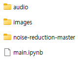

# STT와 TTS를 결합한 소음 제거 모델 (Noise Reduction Model Combining STT and TTS)
- **저자**: 황태연, 고세정, 채준석, 유하진
- **소속**: 서울시립대학교 수학과, 컴퓨터과학부
- **이메일**: {2019540040hh, 010sejung, kiroku97, hjyu}@uos.ac.kr
- 한국정보과학회 KSC 2023 학부생주니어논문경진대회에 투고
- **논문 및 포스터**: https://drive.google.com/drive/folders/192-Cfag3GUfEmBmXc7ReRZRNYXGPROzg?usp=sharing
- **데모(Demo)**: https://hayacchi774.github.io/Noise-Reduction-model-Combining-STT-and-TTS
- **최종 보고서**: https://capstone.uos.ac.kr/cdc/index.php/Pure_Sound

## 요약(Abstract)
 통화 서비스에서 소음을 줄이고 사용자의 목소리를 명확하게 전달하는 것은 중요하다. 그러나 소음 제거 기술을 발전시키는 데에는 상당한 시간이 소요된다. 본 논문에서는 STT(Speech-to-Text)와 TTS(Text-to-Speech)를 결합하여 근본적인 소음 제거 방법을 제안한다. TTS를 통하여 음성을 합성하면 기존의 소음은 없어지고 음성의 명료도는 높일 수 있다. 이때 STT에서 음성을 텍스트로 변환하는 정확도가 중요하며, 본 논문은 STT 앞에 DNS(Deep Noise Suppression)를 결합하고 Fine-tuning하여 CER(Character Error Rate)을 23.62에서 10.56까지 낮추어 정확도를 향상했다. 또한 STT와 TTS 사이에 GPT를 결합하여 TTS에서 자연스러운 음성을 출력할 수 있도록 하였다.

## 핵심 아이디어
### 1. DNS를 결합하는 방식으로 STT를 파인튜닝하여 소음 환경에서의 CER(Character Error Rate)을 낮추었다.

### 2. GPT를 결합하여 STT의 출력 Text 중 완결된 문장에 대한 오류를 개선하였다.
GPT-3.5 프롬프트 튜닝

(왼쪽) STT의 출력 Text, (오른쪽) GPT의 출력 Text

## 데모 구동 방법
### 1. 현재 Repository를 Download한다.

### 2. https://github.com/kotechnia/noise-reduction의 Repository를 Download한 뒤 다음처럼 'noise-reduction-master'라고 저장한다.

### 3. 소음을 제거하고자 하는 음원을 audio 폴더 내에 삽입한다.

### 4. main.ipynb를 Jupyter에서 실행하여 과정을 따라가면 audio/result 폴더 내에 결과물이 생성된다.
